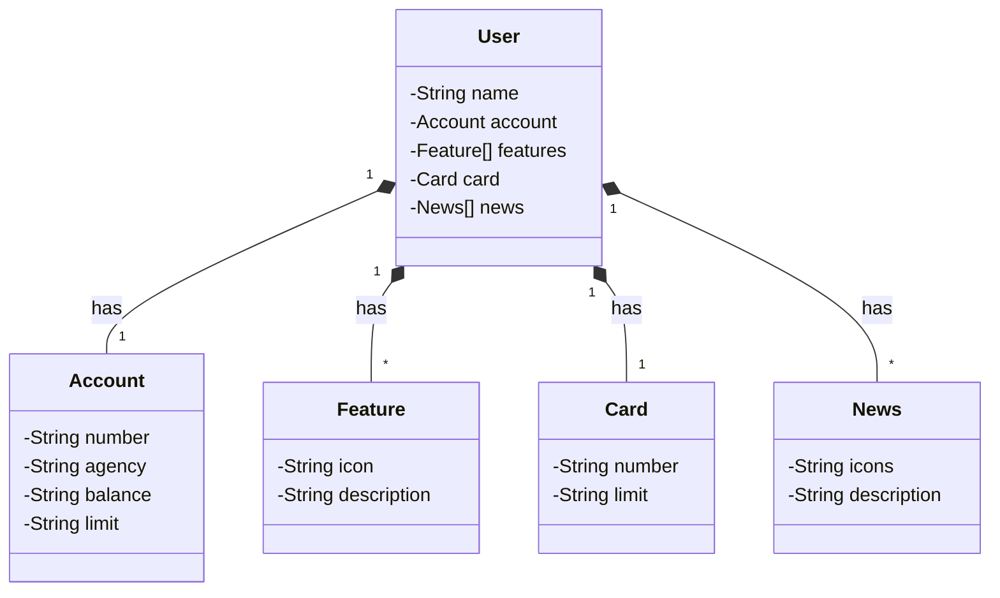

# Projeto Santander Developer Full Stack 2023
initiating API REST na Nuvem Usando Spring Boot 3, Java 17 e Railway

## Representação de diagrama de classes do aplicativo

```mermaid
classDiagram
    class User {
        -String name
        -Account account
        -Feature[] features
        -Card card
        -News[] news
    }
    class Account {
        -String number
        -String agency
        -String balance
        -String limit
    }
    class Feature {
        -String icon
        -String description
    }
    class Card {
        -String number
        -String limit
    }
    class News {
        -String icons
        -String description
    }
    User "1" *-- "1" Account : has
    User "1" *-- "*" Feature : has
    User "1" *-- "1" Card : has
    User "1" *-- "*" News : has
```

